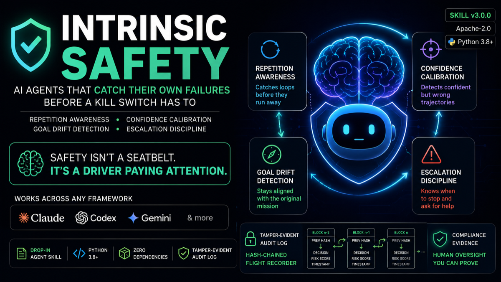

<div align="center">



# 🛡️ self-doubt

### The first agent skill that makes an AI **catch its own failures from the inside** — before an external kill switch has to.

*A drop-in [Agent Skill](https://agent-skills.org) that works across Claude, Codex, Gemini, and any framework that reads `SKILL.md`.*

[](LICENSE)
[](https://www.python.org/)
[]()
[](CHANGELOG.md)
[](references/trigger-conditions.md)
[](references/calibration-guide.md)
[](references/trigger-conditions.md)
[](references/escalation-protocol.md)

</div>

---

## The problem

Every "agent safety" product on the market today is **external**. It watches your
agent from the outside and pulls the plug *after* something has already gone
wrong. The canonical disaster:

> A support agent sent the same customer **89 near-identical emails in 31 minutes**.
> It never *knew* it was looping — it kept executing with full confidence until a
> human noticed and killed it by hand.

Kill switches, governance dashboards, and circuit breakers are real and useful —
but they're all the seatbelt. **Nobody ships the driver paying attention.** The
agent itself has no habit of doubting its own trajectory.

That's the gap this skill fills.

---

## What it does

It gives any agent four cheap, compounding habits that run *as part of its own
reasoning*:

| Discipline | Catches |
|---|---|
| 🔁 **Repetition awareness** | Loops — the #1 runaway failure |
| 🎯 **Confidence calibration** | Hallucinated trajectories (confident + wrong) |
| 🧭 **Goal-drift detection** | Agents wandering off the original task |
| 🛑 **Escalation discipline** | Knowing *when to stop and ask a human* |

Underneath sits a **tamper-evident, hash-chained audit log** the agent writes
itself — a flight recorder that's usable as compliance evidence (e.g. for
demonstrating human oversight under high-risk AI rules).

---

## See it work in 10 seconds

```bash
git clone https://github.com/yash1051/self-doubt.git
cd self-doubt
python3 examples/demo_email_loop.py
```

```
================================================================
 INTRINSIC SAFETY — RUN SCORECARD
================================================================
  Goal:           Send ONE follow-up each to non-repliers in April batch
  Status:         success
  Expected steps: 5  |  Actions taken: 85
----------------------------------------------------------------
  Integrity:      ✅ chain intact
  Triggers fired: 315  (acted on 315, ignored 0)
  Escalations:    80
  Drift events:    80
----------------------------------------------------------------
  Calibration (confidence band → how often prediction held):
      90-100:  100%   (n=5)
----------------------------------------------------------------
  Operator notes: Source export contained 80 duplicate rows; fix upstream.
================================================================

================================================================
 WITHOUT self-doubt:  85 sends (80 duplicates).   ← the disaster
 WITH self-doubt:      5 sends  (0 duplicates).   ← loop caught
================================================================
 Duplicate sends prevented: 80
```

Same model, same tools, same task. The only difference is the discipline. The
demo writes a real hash-chained audit log and prints a scorecard proving the
agent changed its behavior — it didn't just *document* the loop, it *stopped* it.

---

## Why this is different

- **Intrinsic, not extrinsic.** Mem0/Zep solve *memory*. RuntimeAI / ServiceNow /
  Microsoft's governance toolkit solve *external enforcement*. None of them give
  the agent a habit of self-doubt. This is the missing internal half.
- **Portable.** It's a `SKILL.md`, not a platform. The same file works in Claude
  Code, Codex CLI, Gemini CLI, and any custom loop — via the open Agent Skills
  standard.
- **No infra.** No server, no MCP endpoint, no signup. Drop the folder in, done.
- **Provable.** The hash-chained audit log + scorecard let you *show* the skill
  worked, instead of taking it on faith.
- **One call.** `scripts/guard.py` bundles all four disciplines into a single
  invocation per step.
- **Mechanical exit-code contract.** `0 / 2 / 3` (green / yellow / red) so the
  agent loop can branch without parsing text.
- **Zero dependencies.** Pure Python 3 stdlib. Runs anywhere Python 3.8+ runs.

---

## Table of contents

- [Install](#install)
- [Quickstart](#quickstart)
- [How it works](#how-it-works)
- [The four disciplines](#the-four-disciplines)
- [What's in the box](#whats-in-the-box)
- [Framework integration](#framework-integration)
- [Reference docs](#reference-docs)
- [What's new in v3](#whats-new-in-v3)
- [Provenance](#provenance)
- [License](#license)

---

## Install

**Claude Code / Codex / Gemini CLI** — drop the folder into your skills directory:

```bash
git clone https://github.com/yash1051/self-doubt.git
cp -r self-doubt ~/.claude/skills/      # or your tool's skills dir
```

**Any framework** — see [`references/framework-integration.md`](references/framework-integration.md)
for drop-in interceptor patterns (LangGraph, CrewAI, OpenAI Agents SDK, plain loops).

**Python:** 3.8+. No external packages.

---

## Quickstart

```bash
# 1. Open the audit log before the first action
python3 scripts/audit_log.py start \
    --goal "Send ONE follow-up each to non-repliers in April batch" \
    --expected-steps 150 \
    --stop-conditions "No duplicate sends; one email per unique recipient; cap 10 before re-check."

# 2. Before each side-effecting action, run the gate
python3 scripts/guard.py \
    --action send_email \
    --args '{"to":"alice@x.com"}' \
    --goal "Send ONE follow-up each to non-repliers in April batch" \
    --confidence 90 \
    --evidence "clean record, has email; first contact in batch" \
    --on-goal yes \
    --reversibility costly \
    --recipients-this-run 1 \
    --expected-steps 150

# 3. Branch on the exit code:
#    0 = green  → proceed
#    2 = yellow → proceed with caution; warning recorded in the log
#    3 = red    → STOP; trigger logged, escalation is open

# 4. Record what actually happened
python3 scripts/audit_log.py event \
    --type post_action \
    --data '{"action":"send_email","predicted":"200 OK","observed":"200 OK","confidence_was":90,"confidence_should":90,"note":""}'

# 5. End of run: close + verify + scorecard
python3 scripts/audit_log.py close --status success --notes "Source export had 80 dupes; fix upstream."
python3 scripts/audit_log.py verify
python3 scripts/check_run.py --log metacog_audit.jsonl
```

Full walkthrough with the four-discipline rationale lives in
[`SKILL.md`](SKILL.md).

---

## How it works

```text
agent loop
   │
   ├─► Step 0: Is this task big/costly enough to need discipline?
   │              │ no → just do the task
   │              │ yes ↓
   │
   ├─► Step 1: audit_log.py start  → opens a hash-chained log
   │
   ├─► Step 2: guard.py check      → green / yellow / red
   │              │
   │              ├─ repetition (exact + semantic + oscillation)
   │              ├─ confidence (floor by reversibility; no-evidence trigger)
   │              ├─ goal drift (--on-goal no ⇒ fire)
   │              ├─ cost / blast-radius (recipient cap, dangerous tools)
   │              ├─ step budget (2× expected = yellow, 4× = red)
   │              └─ multi-trigger stacking (two yellows = red)
   │
   ├─► Step 3: observe() → post_action event (predicted vs observed)
   │
   ├─► Step 4: if red → escalate or hard stop (see escalation-protocol.md)
   │
   └─► Step 5: close() + verify() + check_run.py → tamper-evident scorecard
```

The gate sits *between* the agent's decision and the side effect. The agent can
want to send email #89; the gate is what stops it.

---

## The four disciplines

### 1. 🔁 Repetition awareness

Catches loops — the single most common runaway failure.

- **3rd identical attempt** (same action + args) → RED. Stop.
- **3rd semantically similar attempt** within a recent window (Jaccard ≥ 0.6
  token overlap) → RED.
- **2 full A-B-A-B cycles** (oscillation, common in agentic coding) → RED.
- **2nd attempt** → YELLOW, allowed only if the first was a transient failure.

Implementation: [`scripts/loop_detector.py`](scripts/loop_detector.py) (called
automatically by `guard.py`).

### 2. 🎯 Confidence calibration

Catches hallucinated trajectories — when the agent is confidently wrong.

Confidence floors scale with action reversibility:

| Reversibility        | Floor | Examples                              |
|----------------------|-------|---------------------------------------|
| Trivial / read-only  | 0     | search, read                          |
| Reversible write     | 50    | draft, local edit                     |
| Costly (reversible)  | 70    | send email, small spend               |
| Irreversible / high  | 85    | delete, large spend, on-chain, public |

The gate also enforces:

- **`confidence_no_evidence`** — confidence ≥ 70 without an `--evidence` clause
  → yellow trigger.
- **`confidence_rose_after_failure`** — confidence jumped ≥ 10 points after a
  missed prediction → red flag (rationalization).

Full rubric and 5 tells of inflated confidence:
[`references/calibration-guide.md`](references/calibration-guide.md).

### 3. 🧭 Goal-drift detection

Catches agents wandering off the original task.

- `--on-goal no` → the agent itself flagged the action as off-goal → RED.
- The audit log's `on_goal` field is summed and reported by `check_run.py` as
  `drift_events`.
- Cross-check every 5 actions and after any sub-goal spawn.

### 4. 🛑 Escalation discipline

Makes the other three safe.

- Pre-run: fill out [`assets/STOPCONDITIONS.template.md`](assets/STOPCONDITIONS.template.md)
  (hard stops, ask-first, auto-OK, default-if-no-response) before any costly
  autonomous run.
- When a trigger fires: pick the least drastic response that fixes it.
  Escalating ladder: **adjust → pause & verify → escalate → hard stop**.
- Format escalations as decision requests, not status updates. Template:

  ```
  🛑 PAUSED — need your call.
  WHAT I WAS DOING:   <one line>
  WHY I STOPPED:      <the trigger that fired, concretely>
  WHAT I FOUND:       <the specific fact that created the fork>
  THE DECISION:       <the exact choice you need from them>
  OPTIONS:
    A) <option> — <consequence>
    B) <option> — <consequence>
  MY RECOMMENDATION:  <which one and why, in one line>
  IF YOU DON'T REPLY: <the safe default you'll take, and when>
  ```

Full guide: [`references/escalation-protocol.md`](references/escalation-protocol.md).

---

## What's in the box

```
self-doubt/
├── SKILL.md                          # the skill itself (start here)
├── README.md                         # this file
├── CHANGELOG.md                      # v3.0.0 / v2.0.0 / v1.0.0 history
├── LICENSE                           # Apache-2.0 + attribution
├── references/
│   ├── trigger-conditions.md         # ← operational core: exact thresholds
│   ├── escalation-protocol.md        # how to stop & ask well
│   ├── audit-log-format.md           # flight-recorder spec (incl. hash chain)
│   ├── calibration-guide.md          # how to make confidence numbers honest
│   └── framework-integration.md      # wiring into real runtimes
├── scripts/
│   ├── audit_log.py                  # hash-chained tamper-evident log
│   ├── loop_detector.py              # exact / semantic / oscillation detection
│   ├── guard.py                      # the gate: all 4 disciplines, one call
│   └── check_run.py                  # post-hoc scorecard + integrity verify
├── assets/
│   └── STOPCONDITIONS.template.md    # pre-run worksheet
└── examples/
    └── demo_email_loop.py            # the 89-email-loop showcase
```

---

## Framework integration

The four disciplines are framework-agnostic reasoning habits, but in production
you want them enforced *mechanically* so a model having a bad day can't skip the
check. Drop-in patterns for popular runtimes:

- **Plain tool-call loop** — reference implementation in
  [`references/framework-integration.md`](references/framework-integration.md#plain-tool-call-loop-no-framework).
- **LangGraph** — add a `metacog_gate` node before each tool node; use
  `interrupt()` for escalation.
- **CrewAI** — wrap each tool in a thin decorator that calls `guard.check()`;
  share one audit log across the crew.
- **OpenAI Agents SDK** — use guardrails / tool-call hooks; require a structured
  `{action, confidence, evidence}` object from the model.

Full recipes: [`references/framework-integration.md`](references/framework-integration.md).

---

## Reference docs

| File | When to read |
|---|---|
| [`SKILL.md`](SKILL.md) | Always — the protocol. |
| [`references/trigger-conditions.md`](references/trigger-conditions.md) | First time you apply the skill in a session — the operational core. |
| [`references/escalation-protocol.md`](references/escalation-protocol.md) | Before any costly autonomous run — how to write a good escalation. |
| [`references/audit-log-format.md`](references/audit-log-format.md) | When integrating the log into your own tooling. |
| [`references/calibration-guide.md`](references/calibration-guide.md) | Whenever you're tempted to say "confidence 95." |
| [`references/framework-integration.md`](references/framework-integration.md) | When wiring into LangGraph / CrewAI / OpenAI Agents SDK / a custom loop. |
| [`assets/STOPCONDITIONS.template.md`](assets/STOPCONDITIONS.template.md) | Before any costly autonomous run — fill out the worksheet. |

---

## What's new in v3

v3 is the **combined release** of two pre-existing self-monitoring skills:

- `self-doubt` v2 (loop detection + calibration mechanics)
- `metacognitive-discipline` v1.0.0 (four-discipline protocol + scorecard)

The combined v3 ships the union: every feature from both, in one Python 3
stdlib package. Highlights:

- **Unified gate** ([`scripts/guard.py`](scripts/guard.py)) — all four
  disciplines, one call.
- **Hash-chained audit log** (SHA-256, `seq` / `prev_hash` / `hash` per event;
  [`audit_log.py verify`](scripts/audit_log.py) detects edits and deletions).
- **Multi-trigger stacking** — two yellows make a red; trigger right after a
  missed prediction → red regardless of individual threshold.
- **Per-reversibility confidence floors** — trivial / reversible / costly /
  irreversible each have their own floor (0 / 50 / 70 / 85).
- **Built-in `confidence_no_evidence` trigger** — enforces the calibration rule
  mechanically.
- **`confidence_rose_after_failure` trigger** — catches rationalization.
- **`dangerous_tool` whitelist** — `rm`, `force_push`, `sign_transaction`, etc.
  always require pause & verify, even at confidence 99.
- **Recipient cap + step budget** — fires before a run exceeds the configured N.
- **`note` event type** — free-form context the agent wants preserved verbatim.
- **Working demo with scorecard** — proves the skill changed behavior
  end-to-end (85 sends → 5 sends, 80 duplicates prevented).

See [`CHANGELOG.md`](CHANGELOG.md) for the full v1 → v2 → v3 history.

---

## Provenance

This skill is the combined work of two prior efforts:

- **`self-doubt` v1–v2** — original loop-detection and calibration mechanics,
  built and iterated on 2026-06-22.
- **`metacognitive-discipline` v1.0.0** by [Antier Solutions][antier] — the
  four-discipline protocol, hash-chained audit log, escalation ladder,
  scorecard, framework integration recipes, STOPCONDITIONS template, and
  calibration guide.

[antier]: https://github.com/your-org/metacognitive-discipline

Where they conflicted on threshold values, the metacognitive-discipline defaults
win (with rationale in [`references/trigger-conditions.md`](references/trigger-conditions.md)).

---

## Anti-patterns — how this skill fails if done wrong

- **Confidence theater.** Writing "confidence: 95" every step without real
  evidence is worse than nothing — it launders recklessness as rigor. The gate
  enforces an evidence clause for any confidence ≥ 70.
- **Ceremony on trivial tasks.** Running the full check on a one-step lookup
  burns tokens and trains the user to ignore your logs.
- **Escalating instead of thinking.** Asking the human every time you're mildly
  unsure makes you useless. Escalation is for genuine forks, not for offloading
  ordinary decisions. Adjust first; escalate when adjusting fails.
- **Logging without acting.** A beautiful audit log that records the agent
  looping 89 times is a *forensic* tool, not a *safety* tool. The point is to
  change behavior, not just document it.
- **Skipping `verify`.** A hash-chained log that no one ever verifies could be
  quietly edited. Always run `audit_log.py verify` on important runs.

---

## When to use it

Engage it for **autonomous, multi-step, or costly** work: agentic coding, long
research, data pipelines, outbound messaging, financial or on-chain actions —
anything you "set and let run." Skip it for one-shot questions; over-applying it
just burns tokens. ([`SKILL.md`](SKILL.md) Step 0 has the exact rule.)

---

## The one-line pitch

> External kill switches stop a runaway agent *after* it starts. This skill makes
> the agent stop *itself* — and prove it did.

---

## License

Apache-2.0. See [`LICENSE`](LICENSE). Use it, fork it, ship it.

---

<div align="center">

<sub>If this prevented your own 89-email incident, ⭐ the repo so the next person finds it.</sub>

</div>
